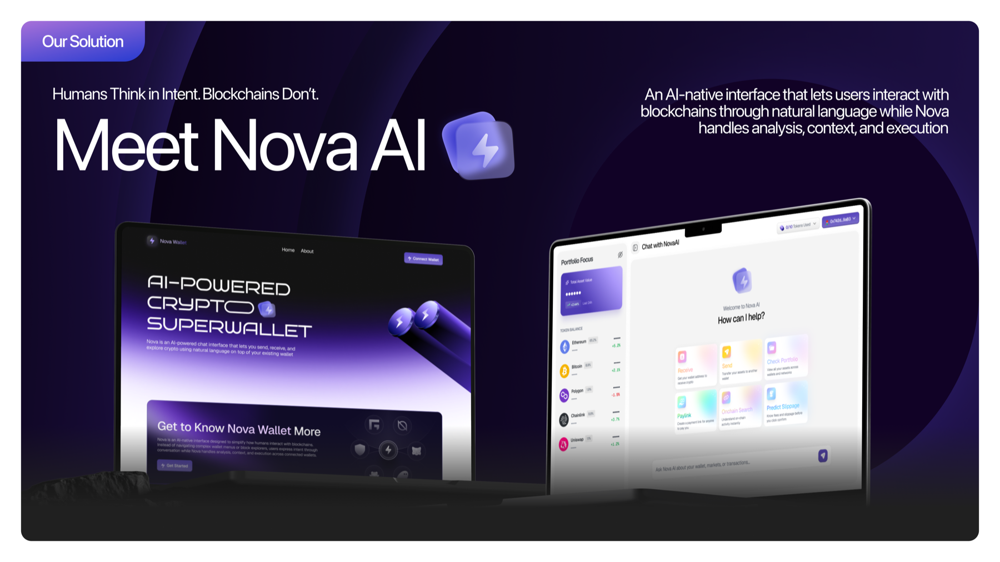
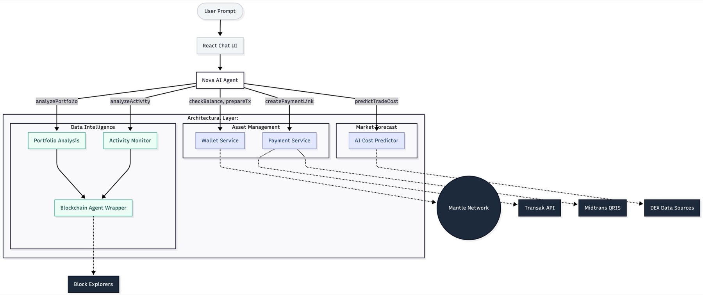
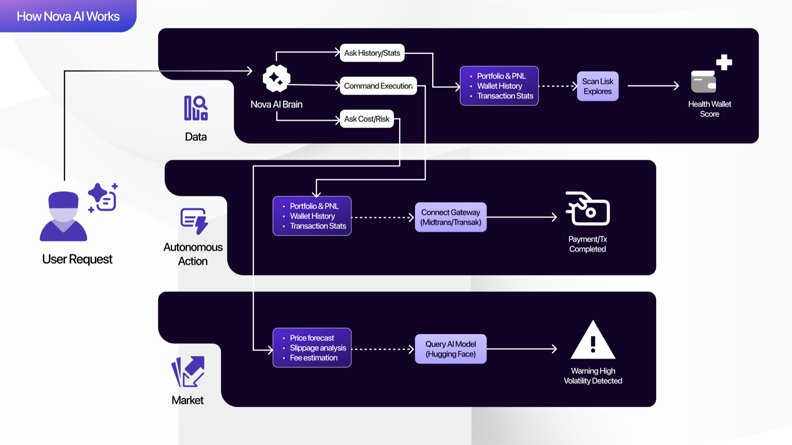
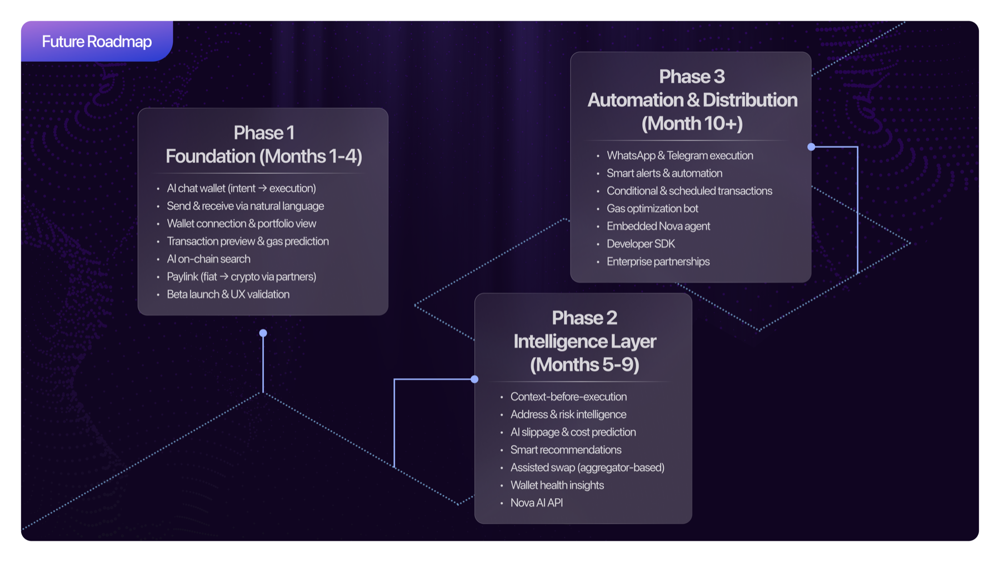
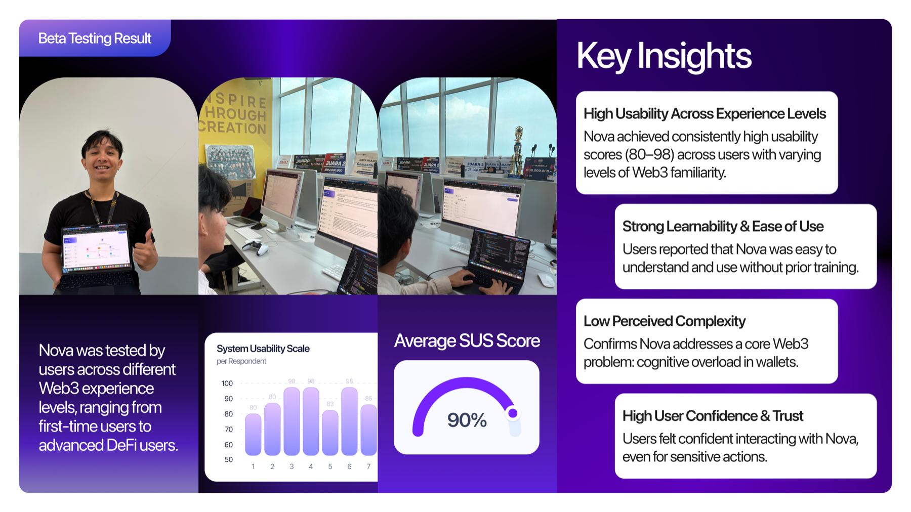

# Nova AI Wallet

> ChatGPT-style wallet orchestration for crypto: chat, analyze, transact, and accept fiat payments without forcing users through complex wallet menus.

Nova AI Wallet is **not a new wallet**. It is an intelligent interface layer that sits on top of existing wallets such as MetaMask and WalletConnect-compatible EVM wallets. The product is Lisk-first, while the codebase already explores a broader multi-chain experience across Ethereum, Mantle, Polygon, Optimism, Arbitrum, Base, and testnets.

## Awards

Nova AI Wallet was recognized in the SEA Lisk Builders Challenge 3 and won two categories:

- **1st Notable Mention** - SEA Lisk Builders Challenge 3
- **1st Social Media Challenge**




## Why Nova

Most crypto wallets still assume users already understand networks, gas, addresses, bridges, explorers, token approvals, and transaction previews. Nova turns those workflows into natural-language conversations.

The core problem:

- **Wallet interfaces are too manual.** Even simple tasks like checking a balance or sending funds require several screens.
- **Addresses are hard to trust.** A raw `0x...` address tells users almost nothing before they send money.
- **On-chain data is powerful but unreadable.** Users jump between explorers, dashboards, and price tools just to answer one question.
- **Transaction costs are unclear.** Gas, route quality, fees, and slippage often appear too late.
- **Crypto payments are still hard for non-crypto clients.** Freelancers can receive crypto, but clients may only want to pay with fiat rails.

Nova's answer is simple: **chat first, smart cards second, wallet signing only after explicit confirmation.**

## Core Features

### 1. Conversational Wallet Interface

Users can ask Nova to check balances, explain concepts, prepare transactions, or analyze wallet activity in plain language.

Example prompts:

- `Cek saldo aku di Mantle Sepolia`
- `Analyze address 0xd8dA...`
- `Kirim 0.01 ETH ke 0x...`
- `Berapa gas yang sudah aku habiskan?`

Nova parses intent, calls the right data source or action, then renders a readable response or an embedded transaction card.

### 2. Portfolio and On-Chain Intelligence

Nova helps users understand wallet behavior, not just raw balances.

Supported analysis areas in the current codebase:

- Native token balance checks
- Portfolio overview
- Token activity and P&L style summaries
- Transaction statistics
- Whale activity detection
- Counterparty and interaction analysis

### 3. Smart Cost Prediction

Nova includes an execution-cost prediction flow for trade cost, slippage, and exchange comparison. The companion API documentation lives in [`api.md`](./api.md).

Use cases:

- Estimate real execution cost before a trade
- Compare venues such as Binance, Kraken, Coinbase, and OKX
- Explain slippage and fees in user-friendly language

### 4. Nova Paylink

Nova Paylink lets freelancers and creators generate a payment link where clients pay in fiat and the receiver gets crypto.

Payment rails:

- **Indonesia:** QRIS via Midtrans
- **Global:** Card/on-ramp flow via Transak

Example prompt:

```text
Buat paylink 0.1 ETH
```

Nova opens a payment form, creates the payment request, and shows a payment status card.

## Product Architecture

Nova uses a chat-first architecture where the AI layer chooses the right action, fetches real blockchain or payment data, and returns a human-readable answer or UI card.



How the flow works:

1. **User prompt:** The user asks a natural-language question or command.
2. **Intent routing:** Nova determines whether the user wants balance, portfolio, payment, cost prediction, or transaction preparation.
3. **Tool/API call:** The app fetches wallet, chain, payment, or prediction data.
4. **Smart response:** Nova renders the result as chat text, cards, forms, or transaction previews.
5. **Wallet confirmation:** Transactions are never executed without explicit user confirmation through the connected wallet.



## Tech Stack

- **Frontend:** Next.js App Router, React, Tailwind CSS, Radix UI, shadcn-style components
- **Wallet:** Wagmi, Viem, RainbowKit, WalletConnect
- **AI:** CopilotKit, Gemini-based chat route, custom intent parsing
- **Blockchain:** RPC reads, Etherscan/Blockscout-style clients, custom on-chain aggregators
- **Payments:** Prisma, PostgreSQL, Midtrans QRIS, Transak
- **Utilities:** Zod, Axios, Upstash rate limiting, Recharts

## Key Screens and Flows

### Chat-to-Transact

```text
User: Kirim 0.01 ETH ke 0x...
Nova: Cek saldo dan network dulu.
Nova: Menampilkan transaction preview.
User: Confirm.
Wallet: User signs the transaction.
```

### On-Chain Research

```text
User: Analyze address 0x...
Nova: Mengambil portfolio, transaksi besar, counterparty, dan statistik.
Nova: Menampilkan ringkasan yang bisa dibaca manusia.
```

### Create Paylink

```text
User: Buat paylink 500 ribu
Nova: Menanyakan token dan wallet penerima.
Nova: Membuat payment link.
Client: Membayar via QRIS atau Transak.
Nova: Menampilkan status pembayaran sampai selesai.
```

## Roadmap

Nova is being shaped into a wallet super-app experience: first as a chat interface, then as an intelligence layer, and eventually as an automation layer for crypto workflows.



## Validation

The project includes early usability framing and beta testing references in the product documentation.



## Documentation

- [`Nova_Wallet_UI_UX_PRD_v2.md`](./Nova_Wallet_UI_UX_PRD_v2.md) - full product and UX requirement document
- [`api.md`](./api.md) - trade execution cost predictor API guide
- [`prisma/schema.prisma`](./prisma/schema.prisma) - payment and webhook database schema

## Local Development

```bash
npm install
npm run dev
```

For production-style flows, configure the required environment variables for database, AI, wallet/RPC providers, Midtrans, Transak, and rate limiting.

## Current Focus

Nova's strongest product direction is:

> **An AI wallet assistant for users who want to understand and act on crypto without opening five different tools first.**

The most important next polish areas are payment reliability, clearer production/demo separation, faster on-chain analysis, and tighter README/demo assets.
